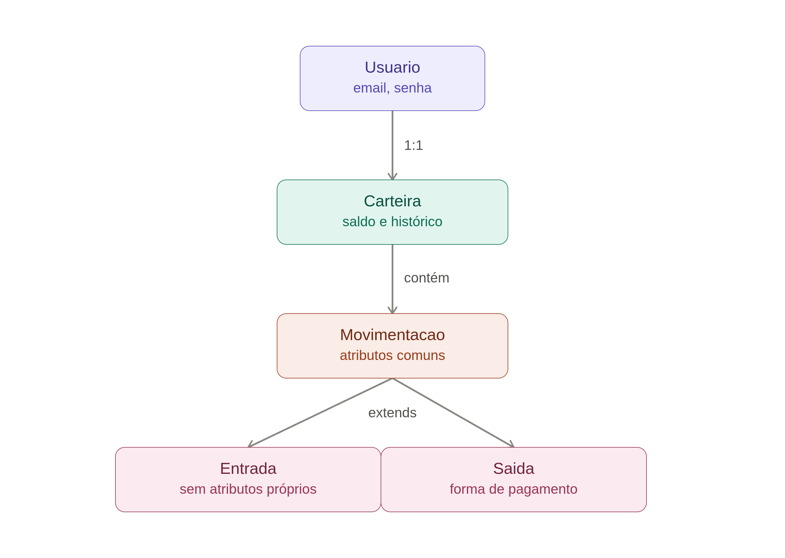

# 💰 BankFlow
 
Aplicação de gestão financeira pessoal desenvolvida em **Java puro** (sem frameworks), como projeto de portfólio focado em demonstrar fundamentos sólidos de **Programação Orientada a Objetos** e **arquitetura de software**.
 
O BankFlow permite que um usuário se cadastre, faça login, registre entradas e saídas financeiras categorizadas, consulte seu saldo e histórico de movimentações (com filtros por categoria), e gere relatórios mensais — tudo via terminal.
 
> Projeto construído com apoio de mentoria socrática de IA, focada em explicar conceitos e revisar código, sem escrever a solução pelo autor. Todo o código foi escrito, testado e depurado pelo autor.
 
---
 
## 📋 Índice
 
- [Funcionalidades](#-funcionalidades)
- [Arquitetura](#-arquitetura)
- [Diagrama de casos de uso](#-diagrama-de-casos-de-uso)
- [Modelo de domínio](#-modelo-de-domínio)
- [Decisões técnicas de destaque](#-decisões-técnicas-de-destaque)
- [Débitos técnicos conscientes](#-débitos-técnicos-conscientes)
- [Tecnologias](#-tecnologias)
- [Como executar](#-como-executar)
- [Estrutura de pastas](#-estrutura-de-pastas)
- [Aprendizados](#-aprendizados)
- [Autor](#-autor)
---
 
## ✅ Funcionalidades
 
- **Cadastro e login de usuário** (nome, sobrenome, email e senha)
- **Cadastrar entrada financeira** (valor, data, descrição, categoria)
- **Cadastrar saída financeira** (valor, data, descrição, categoria, forma de pagamento)
- **Consultar saldo**, com opção de filtro por categoria
- **Consultar movimentações**, com opção de filtro por categoria
- **Gerar relatório mensal**, com total de entradas, saídas, saldo do período e detalhamento por categoria
- Validação de saldo insuficiente ao registrar uma saída
- Validação de dados de entrada em todas as telas (campos obrigatórios, valores positivos, datas válidas, senha com tamanho mínimo)
---
 
## 🏗️ Arquitetura
 
O projeto segue uma separação em camadas inspirada em arquitetura em camadas clássica, pensada para que trocar a interface (hoje terminal, futuramente uma API web, por exemplo) não exija reescrever nenhuma regra de negócio:
 
```
br.com.bankflow
├── domain/         → Entidades e regras de negócio puras
├── application/     → Orquestração dos casos de uso e interação com o usuário
└── util/            → Ferramentas auxiliares reutilizáveis, sem estado
```
 
**`domain`** conhece só as regras do problema (finanças pessoais): como o saldo é calculado, como uma movimentação se comporta, como um usuário se autentica. Não sabe nada sobre terminal, Scanner ou telas.
 
**`application`** orquestra: lê o que o usuário digita, chama os métodos certos das entidades de `domain`, decide o que exibir como resultado (sucesso, erro, listagem).
 
**`util`** guarda funções auxiliares sem estado, reaproveitadas em várias telas — como leitura e validação de campos digitados no terminal.
 
Essa separação foi testada na prática: toda a lógica de negócio (cálculo de saldo, validações, autenticação) está isolada em `domain`, então evoluir o BankFlow para uma interface web no futuro não deveria exigir alterar nenhuma dessas classes — só criar uma nova camada de entrada que reaproveita as mesmas entidades.
 
---
 
## 🎯 Diagrama de casos de uso
 

 
O diagrama define o escopo funcional do MVP a partir da perspectiva do ator `Usuário`, incluindo as extensões `<<extends>>` de "Consultar movimentações" e "Gerar relatórios" para filtro por categoria — ambas implementadas no código final.
 
---
 
## 🧩 Modelo de domínio
 

 
- **`Usuario`** cria automaticamente sua própria `Carteira` no construtor, garantindo estruturalmente a relação 1:1 — nunca existe um `Usuario` sem `Carteira`.
- **`Carteira`** guarda o `saldo` (atributo `private`, sem setter público) e a lista de `Movimentacao`, exposta apenas como view somente-leitura (`Collections.unmodifiableList`). Toda alteração de saldo e histórico passa pelos métodos `registrarEntrada()`/`registrarSaida()`, que fazem as duas coisas juntas, atomicamente — impossível atualizar uma sem a outra.
- **`Movimentacao`** é a superclasse de `Entrada` e `Saida`, compartilhando os atributos comuns (valor, data, descrição, categoria) e permitindo que ambas coexistam na mesma lista, tratadas de forma uniforme (polimorfismo).
- **`Categoria`** é imutável após criada, e carrega um `TipoCategoria` (`ENTRADA`/`SAIDA`) para garantir, por construção, que uma categoria de entrada nunca seja usada numa saída (ou vice-versa).
- **`FormaPagamento`** e **`TipoCategoria`** são `enum`s — conjuntos fixos e conhecidos, escolhidos para evitar valores inconsistentes (ex.: `"cartao"` vs `"Cartão de Crédito"`) e padronizar dados para futuras consultas.
Todas as movimentações são **imutáveis** depois de registradas: não existe `setValor()`. Se o usuário errar um lançamento, a correção é feita registrando uma nova movimentação — nunca editando a existente, o que poderia deixar o saldo da carteira dessincronizado do histórico.
 
---
 
## 💡 Decisões técnicas de destaque
 
| Decisão | Motivação |
|---|---|
| Saldo como atributo `private`, sem setter público | Garante que o saldo só mude através de um comportamento coerente da entidade (registrar movimentação), nunca por atribuição direta |
| Lista de movimentações exposta como view somente-leitura | `Collections.unmodifiableList()` impede alteração externa **garantida pelo runtime**, não só por convenção — testado lançando `UnsupportedOperationException` |
| `registrarEntrada()`/`registrarSaida()` retornam `boolean` | Mantém a `Carteira` (domain) livre de `println`, deixando toda comunicação com o usuário na camada `application` |
| `Carteira` controla a geração de `id` das movimentações via contador dedicado | Evita reaproveitar ids mesmo se uma movimentação for excluída no futuro, e evita duplicação de movimentações registradas por engano |
| `Categoria` carrega seu próprio `TipoCategoria` | A entidade se protege sozinha, em vez de depender que quem a usa lembre de validar a compatibilidade categoria/tipo de movimentação |
| Comparação de categorias por `getId()`, não por `==` | Comparação por identidade de objeto é frágil e dependente de nunca existir uma segunda instância com os mesmos dados; `getId()` não tem essa fragilidade |
| `instanceof` para verificar se uma `Movimentacao` é uma `Saida` | Mais robusto do que inferir o tipo através da categoria associada |
 
---
 
## ⚠️ Débitos técnicos conscientes
 
Decisões tomadas deliberadamente para priorizar o prazo do MVP, documentadas para discussão em entrevista técnica:
 
- **`double` em vez de `BigDecimal`** para valores monetários — adequado para o escopo do MVP, mas `BigDecimal` seria a escolha correta para evitar imprecisão de ponto flutuante em produção.
- **Senha em texto plano**, sem hash — `Usuario.autenticarSenha()` já encapsula a comparação internamente (a senha nunca é exposta via getter), então migrar para BCrypt no futuro não exigiria mudar a assinatura do método usado externamente.
- **`private` sem `final`** nos atributos imutáveis — hoje a imutabilidade depende da ausência de setters (convenção), não de uma garantia do compilador.
- **IDs de `Usuario` gerados por um contador estático em memória** — não persistem entre execuções do programa, já que não há banco de dados.
- **Duplicação de lógica** em `GerenciarCategorias.escolherCategoria()` entre os blocos de `ENTRADA`/`SAIDA` — oportunidade futura de refatoração.
- **Totais por categoria no relatório usam uma variável `double` por categoria** com `switch` no `id`, em vez de uma estrutura `Map<Categoria, Double>` — funciona, mas é frágil a mudanças na ordem/ids das categorias.
- **Sem persistência**: todos os dados (usuários, movimentações) existem apenas em memória, durante a execução do programa.
- **Recorrência/agendamento de movimentações** (ex.: salário ou assinaturas em datas fixas) foi identificado como funcionalidade de valor, mas conscientemente deixado fora do escopo do MVP.
---
 
## 🛠️ Tecnologias
 
- **Java 21** (Temurin)
- Sem frameworks nem dependências externas — Java puro, incluindo `java.time` para manipulação de datas e `java.text.NumberFormat` para formatação monetária
- IntelliJ IDEA como IDE de desenvolvimento
---
 
## ▶️ Como executar
 
1. Clone o repositório:
```bash
   git clone https://github.com/victorrmorenoo/BankFlow.git
```
2. Abra o projeto no IntelliJ IDEA (ou outra IDE com suporte a JDK 21).
3. Execute a classe `Main` em `src/br/com/bankflow/application/Main.java`.
4. Interaja pelo terminal, seguindo o menu exibido.
---
 
## 📁 Estrutura de pastas
 
```
BankFlow/
├── docs/
│   ├── BankFlow_Engenharia_de_Software.docx
│   ├── Diagrama caso de uso - BankFlow.drawio
│   ├── Diagrama caso de uso - BankFlow.png
│   └── bankflow_hierarquia_classes.png
├── src/br/com/bankflow/
│   ├── domain/
│   │   ├── Categoria.java
│   │   ├── TipoCategoria.java
│   │   ├── FormaPagamento.java
│   │   ├── Movimentacao.java
│   │   ├── Entrada.java
│   │   ├── Saida.java
│   │   ├── Carteira.java
│   │   └── Usuario.java
│   ├── application/
│   │   ├── Main.java
│   │   ├── GerenciarUsuarios.java
│   │   └── GerenciarCategorias.java
│   └── util/
│       └── ValidadorCampoObrigatorio.java
└── relatorio-dia-bankflow.md
```
 
---
  
## 👤 Autor
 
**Victor Moreno**
Desenvolvedor em formação, buscando oportunidade como desenvolvedor Java júnior.
 
<a href="https://www.linkedin.com/in/victormorenodev/" target="_blank"></a> 
<a href="https://github.com/victorrmorenoo" target="_blank"></a>
 
